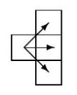
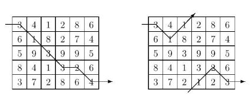
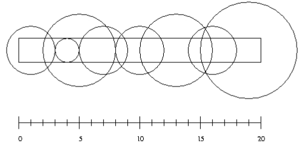

# practice_C
This is practice code(C) used in school assignments.

## Compile and Execute
`gcc {fileName.c} -o {outputName};`
`start {outputName} "{input value}"`

## Find minimum paths 
`(min_path.c)`
Problems that require minimum paths through some domain appear in many different areas of computer science. 
For example, one of the constraints in VLSI routing problems is minimizing wire length. The Traveling 
Salesperson Problem (TSP) — finding whether all the cities in a salesperson’s route can be visited exactly once 
with a specified limit on travel time — is one of the canonical examples of an NP-complete problem; solutions 
appear to require an inordinate amount of time to generate, but are simple to check. 
This problem deals with finding a minimal path through a grid of points while traveling only from left to 
right. 

Given an m×n matrix of integers, you are to write a program that computes a path of minimal 
weight. A path starts anywhere in column 1 (the first column) and consists of a sequence of steps 
terminating in column n (the last column). A step consists of traveling from column i to column 
i+1 in an adjacent (horizontal or diagonal) row. The first and last rows (rows 1 and m) of a matrix 
are considered adjacent, i.e., the matrix “wraps” so that it represents a horizontal cylinder. Legal 
steps are illustrated on the right.

The weight of a path is the sum of the integers in each of the n cells of the matrix that are visited. 
For example, two slightly different 5×6 matrices are shown below (the only difference is the numbers in the 
bottom row).

The minimal path is illustrated for each matrix. Note that the path for the matrix on the right takes advantage 
of the adjacency property of the first and last rows. 
### Input 
The input consists of a sequence of matrix specifications. Each matrix specification consists of the row and 
column dimensions in that order on a line followed by m·n integers where m is the row dimension and n is the 
column dimension. The integers appear in the input in row major order, i.e., the first n integers constitute the 
first row of the matrix, the second n integers constitute the second row and so on. The integers on a line will be 
separated from other integers by one or more spaces. Note: integers are not restricted to being positive. 
There will be one or more matrix specifications in an input file. Input is terminated by end-of-file. 
For each specification the number of rows will be between 1 and 10 inclusive; the number of columns will 
be between 1 and 100 inclusive. No path’s weight will exceed integer values representable using 30 bits. 
  
 
### Output 
Two lines should be output for each matrix specification in the input file, the first line represents a minimal-
weight path, and the second line is the cost of a minimal path. The path consists of a sequence of n integers 
(separated by one or more spaces) representing the rows that constitute the minimal path. If there is more than 
one path of minimal weight the path that is lexicographically smallest should be output. 
Note: Lexicographically means the natural order on sequences induced by the order on their elements. 
### Sample Input  
5 6  
3 4 1 2 8 6   
6 1 8 2 7 4  
5 9 3 9 9 5  
8 4 1 3 2 6  
3 7 2 8 6 4  
5 6  
3 4 1 2 8 6  
6 1 8 2 7 4  
5 9 3 9 9 5  
8 4 1 3 2 6  
3 7 2 1 2 3  
2 2  
9 10 9 10  
### Sample Output  
1 2 3 4 4 5  
16  
1 2 1 5 4 5  
11  
1 1  
19  

## Minimum number of sprinklers 
`(number_of_sprinklers.c)`
n sprinklers are installed in a horizontal strip of grass l meters long and w meters wide. Each sprinkler
is installed at the horizontal center line of the strip. For each sprinkler we are given its position as the
distance from the left end of the center line and its radius of operation.
What is the minimum number of sprinklers to turn on in order to water the entire strip of grass?

### Input
Input consists of a number of cases. The first line for each case contains integer numbers n, l and w
with n ≤ 10000. The next n lines contain two integers giving the position of a sprinkler and its radius
of operation. (The picture above illustrates the first case from the sample input.)
### Output
For each test case output the minimum number of sprinklers needed to water the entire strip of grass.
If it is impossible to water the entire strip output ‘-1’.
### Sample Input
8 20 2
5 3
4 1
1 2
7 2
10 2
13 3
16 2
19 4
3 10 1
3 5
9 3
6 1
3 10 1
5 3
1 1
9 1
### Sample Output
6
2
-1
